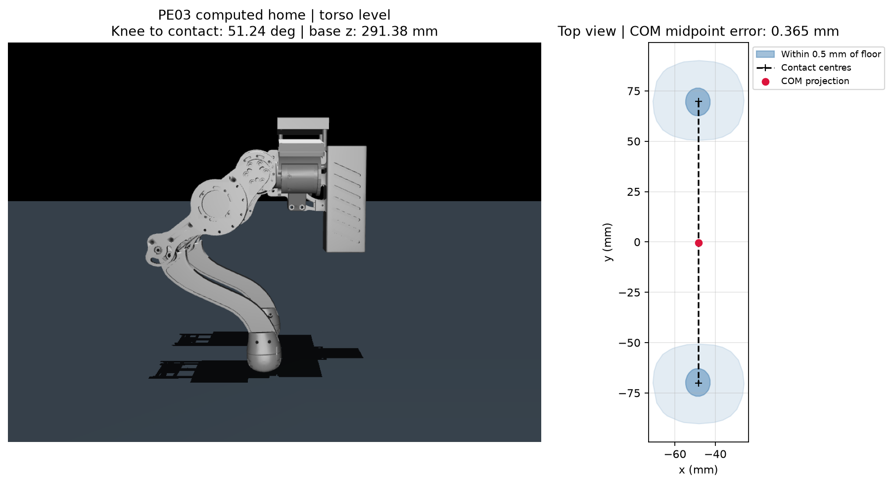

# PE03 CNC 独立训练线

当前资产已于 2026-09-30 同步实测限位 v4，详见 [限位修订](PE03_JOINT_TARGET_LIMITS.md)。
本文原有实验、标定和碰撞数据保留当时版本，不作为新限位的验证结果。

新增独立 WTW 步态训练线：见 [PE03_WTW_GAIT.md](PE03_WTW_GAIT.md)。使用
`pe03_gait_fixed` / `pe03_gait_variable` 预设与 v4 观测；下文 v2/v3 迁移基线仍保留。

2026-09-18：从复制时最新 PE02 工作区迁移，使用 `/home/angela/下载/点足CNC` 模型。
已通过资产、站姿、小规模训练/续训/回放/导出、Python/C++ 闭环及 4096 环境短训。
本次未做 1000 轮训练，也未验收学会稳定站立或行走。

## 日常命令

在仓库根目录执行，无需激活 Conda 或手写环境变量：

```bash
# 32 个 MuJoCo 线程，4096 环境，每环境 24 步，1000 轮，TensorBoard 开启
bash tools/train.sh pe03_standing
bash tools/train.sh pe03_walking

# 查看最终参数，或临时覆盖
bash tools/train.sh pe03_walking --dry-run
bash tools/train.sh pe03_walking algo.max_iterations=2000

# 已训练保存后，回放相应任务的最新模型；窗口持续到关闭
bash tools/train.sh pe03_standing mode=play checkpoint=-1
bash tools/train.sh pe03_walking mode=play checkpoint=-1

# 续训：原训练配置与模型合同必须一致，1000 是本次新增轮数
bash tools/train.sh pe03_walking \
  training.resume=logs/pe03_walking/<run_id>/model_1000.pt \
  algo.max_iterations=1000

# TensorBoard
/ssd/conda/envs/aar_unilab/bin/tensorboard \
  --logdir logs/pe03_walking/tensorboard_runs --host 127.0.0.1 --port 6006
```

默认文件为 [conf/train_defaults.yaml](../conf/train_defaults.yaml)。standing 每 50 轮保存，
walking 每 100 轮保存；都在结束时保存。直接运行 `scripts/train_pe03.py` 不读取这个
启动预设文件，不带 experiment 时仍是复制的正式 v2 基线（含随机化）。日常请选以上两个预设。
`training.mujoco_threads=32` 是 MuJoCo 线程数；`training.cpu_threads=1` 是 Torch CPU 线程数。

PE03 独立维护下列配置和模块：

| 内容 | 位置 |
| --- | --- |
| 环境、观测、奖励与配置加载 | `src/unilab/envs/locomotion/pe03/` |
| Encoder、Actor/Critic、PPO、Runner、控制台与 TensorBoard | `src/unilab/algos/torch/pe03/` |
| 训练、checkpoint 适配器 | `src/unilab/adapters/pe03_ppo.py` |
| 入口、回放、导出 | `scripts/train_pe03.py` |
| Hydra 配置 | `conf/pe03/config.yaml`、`task/pe03_flat.yaml`、`experiment/{standing,walking}.yaml` |
| 模型 | `src/unilab/assets/robots/pe03/` |
| C++ 运行时 | `sim2sim/include/aar/pe03_runtime.hpp` |

生产代码不导入或继承 PE01/PE02。共用 catalog、MuJoCo 后端、回放窗口与 release 基础设施。
注册 `pe03`、`pe03_flat`、`pe03_encoder_mlp`、`pe03_custom_ppo`、`pe03_v2`、`pe03_v3`；
没有 PE03 v1 最小训练入口。复制时 28 个 PE02 工作区源码文件的 SHA256 和 Git HEAD
保存在模型的 `analysis/training_source_manifest.json`；结束时核对这 28 个源文件均未改变。

## 训练合同

| 项目 | standing | walking |
| --- | --- | --- |
| 正式观测 | `pe03_v2`，30 维帧/300 维历史/33 维 critic | `pe03_v3`，24 维帧/240 维历史/27 维 critic |
| 历史长度 | 10 帧 | 10 帧 |
| 命令 | 全零 | x ±1 m/s、y ±0.6 m/s、yaw ±1 rad/s；20% 零命令 |
| 步态 | v2 布局保留，频率与摆高为零 | `gait: null`，无步态时钟、相位奖励或规定足端轨迹 |
| 初始化 | 固定新 home | 固定新 home |
| 随机化/噪声/推力/延迟 | 全关，延迟 0 | 全关，延迟 0 |
| 高度目标 | 新 home，0.2913829166803791 m | 新 home，误差 std=0.03 m |
| 终止 | 非足端接触或 35° 倾斜持续 0.2 s | 原宽松累计失败 0.5 s；机身接触/严重倾斜 |

walking 保留当前 PE02 v3 的奖励：线速度 6、yaw 3、足端滑动 -1、腾空时间 0.25、
腾空高度 0.25（1–10 cm 区间）、机身接触 -20、严重倾斜 -20，以及现有姿态、
力矩、动作平滑等项。准确配置以 `conf/pe03/experiment/walking.yaml` 为准。
两侧 `L_foot_Link_collision_sole_0` / `R_foot_Link_collision_sole_0` 才是合法足底接触。
其他部位保留各任务处罚与终止规则。

初始控制配置全部复制 PE02，**不代表 CNC 样机的新参数辨识**：物理/PD 400 Hz，策略
50 Hz；Kp `[4.3,4.3,4.9]×2`，Kd `[0.34,0.34,0.24]×2`，力矩上限
`[5.5,5.5,14]×2 N·m`，动作尺度 0.25 rad。XML 的阻尼、armature 同样是沿用值。
Encoder 隐层 256/128、输出 3；Actor/Critic 隐层 512/256/128，Encoder 单独监督更新。

## 模型和碰撞

原 URDF 在 `source/original.urdf`，原导出 CSV 在 `source/original.csv`。
`asset_manifest.json` 保存源文件 SHA256、完整视觉网格 SHA256 和质量修正。
左右小腿均为 **0.118 kg**，修正后全机 **3.26689 kg**；保留源 COM 与惯量。
仅右小腿质量从 0.098 改为 0.118 kg，没有按碰撞体体积重估质量或惯量。

原 STL 完整转为 OBJ，共 **1,108,802 面**，回放仍有原始孔洞和细节。
训练编译删除视觉 geom 和资源，仅保留 **26 个碰撞几何体**、1,206 个碰撞网格顶点、
2,336 面，当前训练编译模型缓冲区为 641,492 字节。

碰撞配方：机身 8 个盒体/圆柱/支架凸包；每侧髋 2 个、大腿 3 个组件；
每侧 CNC 小腿按新网格重新拟合 3 段凸包；每侧足端 1 个保留曲面的凸包。
新 CAD 组件经过边界、面积匹配和重新排序，未直接照抄旧组件序号。
小腿分段后比单凸包减少约 42.28% 的填充体积。

URDF/MJCF 使用相同碰撞定义，惯量显式独立。凸包减面的最大实测误差 **0.497923 mm**，
上限 0.5 mm；这相对各组件减面前凸包，不是对整个凹形 CAD 的外形误差保证。
默认支撑平面附近 1 mm 的足端凸包顶点保留。全部结果见
`analysis/component_mapping.json`、`analysis/collision_audit.json` 和 `collision_comparison.png`。

## 新站姿与静态支撑

从足端凸包下侧支撑面中，搜索小腿转轴至支撑点连线与地面夹角在 45–56° 的候选，
以支撑平面上方 0.5 mm 的截面积最大为目标，再使用真实装配位姿独立求解六关节和根高度。
机身保持水平；保留两侧装配导出的小差异，没有强制左右角度完全镜像。

| 项目 | 结果 |
| --- | --- |
| base link 高度 | 0.2913829166803791 m |
| 左髋/大腿/小腿 | 1.326962° / -17.898833° / -71.856263° |
| 右髋/大腿/小腿 | -1.326962° / 17.899525° / 71.855361° |
| 两侧小腿至支撑点夹角 | 51.241725° |
| COM 距支撑中心中点 | 0.364549 mm，主要是源质量分布的横向偏差；限值 0.5 mm |
| 支撑面几何接地误差 | 小于 1 μm；编译碰撞体足底误差约 -0.000523 μm |
| 每足上方 0.5 mm 截面积 | 130.994677 mm² |
| 默认姿态 | 无自碰撞，无超限关节，无明显地面穿透 |
| 左/右垂直支撑力 | 15.94065 / 16.10754 N |
| 左静态关节力矩 | -0.02549 / 0.49077 / 1.88270 N·m |
| 右静态关节力矩 | 0.02630 / -0.49233 / -1.90385 N·m |

场景 `home` 与奖励高度均已使用新结果。所有静态支撑力矩低于复制的力矩上限。
这是一组静态逆动力学估计，不是站立控制器；Kp 有限时仍需策略输出位置偏置来产生支撑力矩。
曲面足端的近地截面积不是刚性接触面积，也没有引入材料形变模型。



home 周围 ±5° 的 500 个姿态未发现自碰撞；1000 个全关节范围随机姿态中有 329 个自碰撞。
全关节限位笛卡尔积不保证物理可达，故本次保持固定初态，不将这些姿态加入随机初始化。

## 回放、导出和产物

Python 回放复制了棋盘地面、亮色天空、机身坐标 x/y 速度、yaw 角速度和 base link
高度显示；Free 相机由用户控制，逐帧更新不移动相机。外观文件从所选模型旁加载，随 release 搬迁。
ONNX 导出仍通过 `scripts/train_pe03.py:export_release`；正常训练结束默认自动导出。

- 训练：`logs/pe03_standing/<run_id>/`、`logs/pe03_walking/<run_id>/`。
- checkpoint：`model_<iteration>.pt`，包含 PPO、Encoder、随机数和环境续训状态。
- TensorBoard：每个任务根目录的 `tensorboard_runs/`，名称带 `PE03__pe03_flat-mujoco`。
- 正常 release：`releases/pe03/pe03_flat/<run_id>/`，包含 ONNX、模型、运行配置和 golden 数据。
- 本次开发验证：`logs/pe03-validation/20260918/`，准确文件列表在 `artifacts.json`。
  短训 release 已移入此验证目录下的 `releases/pe03/pe03_flat/`；日志中的原导出路径保留供追溯。

Python 续训/回放拒绝 PE01、PE02 checkpoint；PE03 v2/v3 也不能跨观察合同直接续训。
C++ 通过 `pe03_v2` / `pe03_v3` 选择独立运行时，读取 `robot/pe03_runtime.json`。
验证命令示例：

```bash
env -u PYTHONPATH OPENBLAS_NUM_THREADS=1 OMP_NUM_THREADS=1 MKL_NUM_THREADS=1 \
  /ssd/conda/envs/aar_unilab/bin/python tools/compare_pe03_sim2sim.py \
  --binary sim2sim/build/aar_sim2sim \
  --release logs/pe03-validation/20260918/releases/pe03/pe03_flat/2026-09-18_12-07-50_408622_mujoco \
  --steps 1 10 100

# 查看本次短训模型；用于验证流程，不代表已训练成功的行走策略
bash tools/train.sh pe03_walking mode=play checkpoint=-1 \
  training.log_root=logs/pe03-validation/20260918/walking
```

## 验证结果

环境：SSD Conda `aar_unilab`，MuJoCo 3.8.0，RTX 4060 Laptop 8 GiB，主机约 31 GiB RAM。

- standing/v2、walking/v3 各 64 环境×24 步×3 轮，并各续训 1 轮。
  验证 PPO/Encoder 都有更新，完整恢复状态，保存 checkpoint、TensorBoard、ONNX 和 release。
- 两任务都通过实际 CLI 的 `checkpoint=-1` 无窗口 100 步回放。
- ONNX 与 Torch 输出通过 `atol=1e-6, rtol=1e-5` 检查，包含搬迁后 release 回放。
- 两任务 Python/C++ 1、10、100 步的动作、控制量、base link 高度对照最大误差均为 0。
- 4096 环境×24 步×5 轮 walking 正式短训，32 个仿真线程，CUDA、TensorBoard 开启；
  累计 491,520 样本，PPO/Encoder 各 100 次更新，成功保存 `model_5.pt`。
- 另以相同完整采样+PPO/Encoder 配置预热 2 轮、测量 5 轮（关闭记录、导出、评估）：
  **62,812 样本/秒**，每轮采样 1.112 s、更新 0.453 s，总计 1.565 s；
  进程峰值 RSS **1.604 GiB**、本进程 swap 0；Torch CUDA 峰值 allocated **548.89 MiB**、
  reserved **768 MiB**。CUDA 数字不含全部驱动/显示桌面占用，短测速度不代表收敛后接触负载。
- PE03 69 项测试通过；加共享回放及 WE11 flat/rough compose/init/step，共 **79 项通过**。
- 全仓非 slow pytest：**380 passed，2 xfailed**。C++ 构建成功，CTest **6/6** 通过。
- PE03 新文件和改动的 catalog：Ruff 格式/检查通过；`git diff --check` 通过。
- 全仓 Ruff 格式仍有 **12 个已有文件**不合规；Ruff check **7 个已有问题**，集中于
  `scripts/pace/`、`sim2sim/we11_play/scripts/`。mypy **1 个已有错误**：
  `src/unilab/base/backend/mujoco/playback.py:35` 的 `func-returns-value`。
  这些文件本次未修改，详细诊断保存在验证目录。没有隐藏、跳过或更改检查规则。

验证目录的 `train_*.log`、`resume_*.log`、`*_cpp.log`、`benchmark4096.json`、
`focused_final.log`、`pytest_full.log`、`ruff_*.log`、`mypy.log`、`ctest.log` 保存实际输出。
桌面上的手柄和鼠标操作未做人工验收；共享相机/HUD 行为有自动回归检查，离屏渲染通过。
后续是正常训练与步态效果评估，以及 CNC 样机参数辨识，不需再补训练入口框架。
