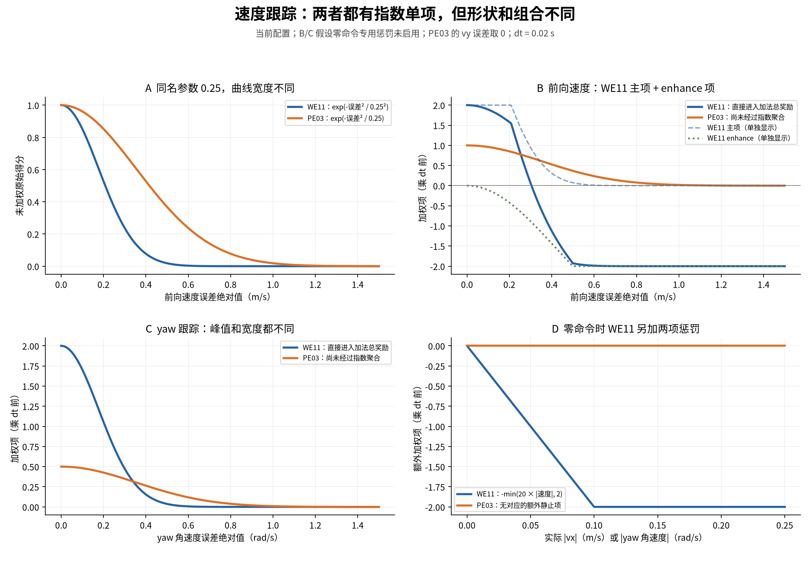
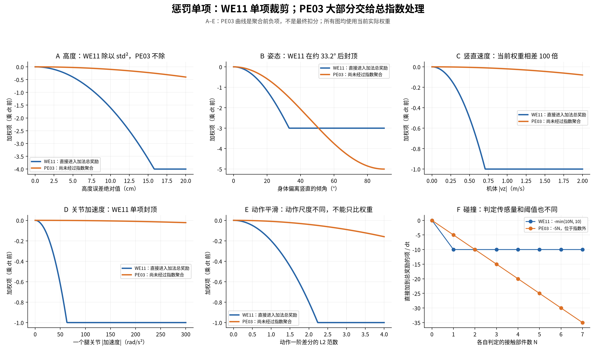
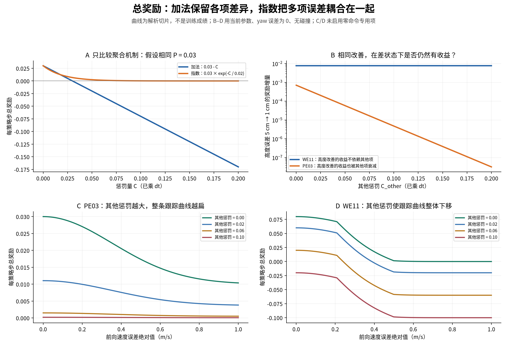

# PE03 与 WE11 奖励公式、曲线对照

核对日期：2026-09-20。PE03 使用当前 `pe03_gait_flat / gait_fixed`；WE11 使用当前
`dr002_joystick_flat_we11/mujoco`。WE11 rough 继承同一套奖励参数和聚合方式，
但身体高度改用地形扫描估计的离地高度。本文不包含独立 getup 任务对奖励的额外处理，
也不代表历史 checkpoint 保存的旧配置。

最主要的区别：**WE11 将各项加权、分别裁剪后相加；PE03 将速度跟踪作为正收益，
再用大部分惩罚的指数共同衰减这笔收益，最后单独扣碰撞分。** 两者的速度跟踪单项都
有指数函数，区别并不是“WE11 完全不用指数”。

图是当前公式的解析曲线，不是训练结果。PNG 用于查看，SVG/PDF 用于放大和导出。
所有图和配置快照位于 [图表目录](assets/pe03_we11_rewards_20260920/)。

**先统一单位和记号。** 两个任务的策略步长都是 \(\Delta t=0.02\,s\)。
令 \(b_i\) 表示乘时间步长前的加权项。它与日志、最终每步奖励不是同一个数量：

| 数量 | 含义 |
|---|---|
| 原始误差/得分 \(f_i\) | 如高度误差平方、速度指数得分 |
| 加权项 \(b_i\) | 加入配置权重；WE11 还做单项限幅 |
| 每步加权项 \(\Delta t\,b_i\) | 再乘 0.02 |
| 最终奖励 \(R\) | WE11 直接相加；PE03 还要进行指数聚合 |

**WE11 的总公式。**

\[
b_i=\operatorname{clip}(w_i f_i,-L_i,L_i),\qquad
R_W=0.02\sum_i b_i
\]

\(L_i\) 是该项上限。多数项取 1；前向速度主项、enhance 项和 yaw 各取 2；
姿态取 3；身体高度取 4；碰撞取 10。当前 `only_positive_rewards=false`，
因此总奖励可以为负。`alive` 虽有实现，当前权重为 0，不提供存活加分。

“加法”不表示每项都是误差的一次函数；单项可以是平方、指数、绝对值或计数。
它表示这些单项之间通过求和组合。

**PE03 的总公式。** 令 \(p\) 为正加权项之和，\(c\ge0\) 为除碰撞之外的负加权项
绝对值之和，\(N\) 为符合当前碰撞判定的非足端部件数：

\[
R_P=(0.02p)\exp\left(-\frac{0.02c}{0.02}\right)-0.1N
    =0.02p\exp(-c)-0.1N
\]

这里指数分母来自 `sigma_negative=0.02`。也可以记每步惩罚量 \(C=0.02c\)，则
\(R_P=P\exp(-C/0.02)-0.1N\)，其中 \(P=0.02p\)。不要把 \(c\) 和 \(C\) 混用。
当前 PE03 没有独立存活奖励，也没有终止瞬间的统一失败扣分。

**速度跟踪：同样写 0.25，实际宽度不同。**

令 \(e_x=v_x-v_x^{cmd}\)，\(e_y=v_y-v_y^{cmd}\)，
\(e_\omega=\omega_z-\omega_z^{cmd}\)。下表列的是乘 0.02 前的加权项。

| 项目 | WE11 | PE03 |
|---|---|---|
| 前向/平面速度主项 | \(\min(4e^{-e_x^2/0.25^2},2)\) | \(e^{-(e_x^2+e_y^2)/0.25}\) |
| 前向速度 enhance | \(\max(4[e^{-e_x^2/0.6^2}-1],-2)\) | 无 |
| yaw 跟踪 | \(2e^{-e_\omega^2/0.25^2}\) | \(0.5e^{-e_\omega^2/0.25}\) |
| 零命令专用项 | 分别加 \(-\min(20\lvert v_x\rvert,2)\)、\(-\min(20\lvert\omega_z\rvert,2)\) | 无；仍保留交替步态参考 |

WE11 的零命令项在 \(|v_x^{cmd}|<0.05\) 且 \(|\omega_z^{cmd}|<0.05\) 时启用。
WE11 的命令顺序是 vx、yaw、高度；PE03 的速度命令是 vx、vy、yaw，因此不能按
相同命令数组下标直接比较。

WE11 将 0.25 当作宽度再平方，分母是 0.0625；PE03 直接用 0.25 作分母，相当于
\(\exp[-(e/0.5)^2]\) 的宽度。PE03 对同样的速度误差衰减更慢。下面取 PE03 的
\(e_y=0\)，列出尚未加权的主项：

| 速度误差绝对值（m/s） | WE11 原始指数得分 | PE03 原始指数得分 |
|---:|---:|---:|
| 0 | 1 | 1 |
| 0.25 | 0.3679 | 0.7788 |
| 0.50 | 0.0183 | 0.3679 |
| 1.00 | 0.000000113 | 0.0183 |

WE11 的前向主项还存在限幅平台：误差小于约 0.208 m/s 时，加权主项为 2。
但 enhance 项仍在变化，所以两个前向项相加后并非完全平坦。
enhance 虽然权重为正 4，函数值却为非正数，是一项额外误差惩罚。
主项加 enhance 可以小于零；PE03 的速度主项自身始终非负。



**身体状态与运动质量：WE11 直接扣分；PE03 的这些负项先进入指数。**

下表仍使用乘 dt 前的量。\(\theta\) 是机身偏离竖直的倾角，
\(\|g_{xy}\|^2=\sin^2\theta\)；\(\Delta a=a_t-a_{t-1}\)。

| 项目 | WE11 加权项（已做单项限幅） | PE03 聚合前加权项 |
|---|---|---|
| 高度误差 \(e_h\)，单位 m | \(-\min[0.4(e_h/0.05)^2,4]=-\min(160e_h^2,4)\) | \(-10e_h^2\) |
| 身体姿态 | \(-\min(10\sin^2\theta,3)\) | \(-5\sin^2\theta\) |
| 竖直线速度 | \(-\min(2v_z^2,1)\) | \(-0.02v_z^2\) |
| roll/pitch 角速度 | \(-\min[0.2(\omega_x^2+\omega_y^2),1]\) | \(-0.001(\omega_x^2+\omega_y^2)\) |
| 力矩 | 腿、轮分别 \(-\min(10^{-4}\sum\tau^2,1)\) | 六关节一起 \(-10^{-4}\sum\tau^2\) |
| 关节速度 | 腿关节 \(-\min(5\times10^{-5}\sum\dot q^2,1)\) | 六关节 \(-10^{-4}\sum\dot q^2\) |
| 关节加速度 | 腿、轮分别 \(-\min(2.5\times10^{-4}\sum\ddot q^2,1)\) | 六关节 \(-2.5\times10^{-7}\sum\ddot q^2\) |
| 动作一阶差分 | \(-\min(0.2\|\Delta a\|^2,1)\) | \(-0.01\|\Delta a\|^2\) |
| 动作/目标二阶差分 | 腿关节动作 \(-\min(0.03\|a_t-2a_{t-1}+a_{t-2}\|^2,1)\) | 关节目标 \(-0.1\|q_t^*-2q_{t-1}^*+q_{t-2}^*\|^2\) |
| 关节限位 | 腿关节超出硬范围的距离和，权重 −1，负项下限 −1 | 六关节超出软范围的距离和，权重 −10 |
| 非足端碰撞 | \(-\min(10N_W,10)\) | \(-5N_P\)，直接加在指数外 |

PE03 还有关节目标一阶差分 \(-0.1\|q_t^*-q_{t-1}^*\|^2\)，因此不能只比两边
`action_rate` 的权重判断整体平滑强度。两边动作尺度、腿/轮的控制含义也不同。
关节加速度是 \((\dot q_t-\dot q_{t-1})/dt\)；动作/目标的一阶、二阶差分不再除 dt。

WE11 高度项是**归一化平方惩罚**，不是高度指数奖励。PE03 当前高度项没有 std：
它相对 home 高度约 0.29138 m 计算米制误差平方。WE11 flat 则跟踪高度命令。
WE11 的高度项在误差约 15.8 cm 后封顶；姿态项在约 33.2° 后封顶。
图中姿态只画 0–90°：两者的投影重力 xy 平方在更大倾角下不是单调增加的全角度倒地代价。

WE11 碰撞统计的是配置的 touch 传感量超过 0.1 的个数；PE03 使用选定非足端部件
净接触力范数超过 1 N 的个数。两者检测集合和阈值不同，\(N_W\) 与 \(N_P\) 不能
认作同一物理接触的完全相同计数。WE11 当前配置的该项一个接触就达到封顶；
PE03 多部件碰撞逐项累加。



**PE03 独有的步态引导怎样进入奖励。** WE11 是轮腿结构，当前任务没有双足交替摆动参考。
PE03 下列项全部加入 \(c\)，然后共同进入总指数：

| PE03 项目 | 加入 \(c\) 的非负代价（乘 dt 前） |
|---|---|
| 摆动期接触力 | \(4\cdot\frac12\sum_i(1-d_i)[1-e^{-\|F_i\|^2/(0.08mg)^2}]\) |
| 支撑期足端速度 | \(4\cdot\frac12\sum_i d_i[1-e^{-\|v_i\|^2/10}]\) |
| 摆动净空误差 | \(30\sum_i(1-d_i)(h_i-h_i^*)^2\) |
| 水平足端位置误差 | \(10\sum_i\|p_{i,xy}-p_{i,xy}^*\|^2\) |
| 接触时防滑 | \(0.04\sum_i I_i\|v_{i,xy}\|^2\) |

\(d_i\in[0,1]\) 是平滑支撑目标；\(I_i\) 使用本步或前一步接触的过滤结果。
净空和水平目标先经过离线工作空间投影；验收仍按原始净空命令统计。
因此 PE03 相比 WE11，不仅聚合方式不同，指数里还多了几组同时需要满足的步态约束。

**最终曲线：其他错误会不会改变某一项改善的价值？**

假设先统一两者的正收益为 \(P=0.03\)，仅比较聚合机制：

\[
R_{\mathrm{add}}=0.03-C,\qquad
R_{\mathrm{exp}}=0.03\exp(-C/0.02).
\]

这里加法的 \(C\) 是已经经过各项限幅、再乘 dt 后的惩罚总量。
此例刻意统一 P，不代表 WE11 实际正收益上限是 0.03。理想速度跟踪时，
WE11 三个速度项合计每步 0.08，PE03 的两个速度项合计每步 0.03。

| 每步惩罚量 C | 同 P 的加法总奖励 | 同 P 的指数总奖励 |
|---:|---:|---:|
| 0 | 0.030 | 0.030 |
| 0.02 | 0.010 | 0.011036 |
| 0.06 | −0.030 | 0.001494 |
| 0.10 | −0.070 | 0.000202 |
| 0.20 | −0.170 | 0.000001362 |

在 WE11 中，一项代价增大通常使总奖励下移；其他项改善带来的直接收益仍然保留，
前提是该改善没有完全落在本项限幅平台上。

在 PE03 中，令 \(C=C_i+C_{other}\)：

\[
R=P\,e^{-C_i/0.02}e^{-C_{other}/0.02}+R_{collision}.
\]

即使只改善高度，改善带来的奖励差异也要乘上 \(e^{-C_{other}/0.02}\)。
例：高度误差从 5 cm 降到 1 cm，速度跟踪完美、其他量不变、无碰撞时：

| 其他惩罚量 \(C_{other}\) | WE11 奖励增量 | PE03 奖励增量 |
|---:|---:|---:|
| 0 | +0.00768 | 约 +0.000711 |
| 0.10 | +0.00768 | 约 +0.00000479 |

这个差异同时包含当前高度权重的差异和 PE03 的跨项衰减，不能全部归因于指数。
但 WE11 增量不随其他项变化、PE03 增量随其他惩罚缩小，这一点来自聚合方式本身。



**读这三张图时的结论。** WE11 的单项指数会衰减、单项裁剪也会变平，因此它也并非
处处都有强学习信号。PE03 额外存在“多个错误共同压缩全部跟踪收益”的效应；
某个运动质量或步态项很差时，其他方面改善的回报差异也可能很小。
`sigma_negative` 是连续衰减尺度，没有超过阈值才突然开启的机制。
PPO 根据采样回报和优势学习，不是对奖励曲线直接反向求导；这里讨论的是可区分的
回报差异被压缩，不能把曲线斜率直接等同于神经网络梯度。

PE03 的碰撞项是例外：它位于指数外，每部件每步扣 0.1，不会因为指数衰减而消失。

**日志对照也要统一口径。** WE11 的 `reward/项名` 通常记录乘 dt 前、已经单项限幅的
加权项；PE03 的 `reward/项名` 记录乘 dt 后、进入聚合前的加权项。直接对比日志绝对值
可能先相差 50 倍，随后还存在 PE03 指数聚合造成的差异。
PE03 应结合 `gait/positive_reward`、`gait/exponential_negative_reward`、
`gait/attenuation` 和 `gait/additive_reward` 判断最终作用。

**来源与复现。**

- [WE11 owner YAML](../conf/ppo/task/dr002_joystick_flat_we11/base.yaml)：当前权重、宽度和单项限幅。
- [WE11 单项实现](../src/unilab/envs/locomotion/dr002/joystick.py)：`_clip_lingzu_reward`、`_reward_*`。
- [WE11 求和实现](../src/unilab/envs/locomotion/common/rewards.py)：`run_reward_dispatch`。
- [PE03 owner YAML](../conf/pe03/task/pe03_gait_flat.yaml)：当前独立步态任务。
- [PE03 单项及聚合实现](../src/unilab/envs/locomotion/pe03/gait_env.py)：`_rewards`。
- [配置与源码指纹快照](assets/pe03_we11_rewards_20260920/snapshot.json)。
- [生成脚本](assets/pe03_we11_rewards_20260920/generate.py)：对 9 个 WE11 主要项的曲线表达式与生产方法做数值交叉检查，再绘图。

```bash
env -u PYTHONPATH PYTHONNOUSERSITE=1 \
  /ssd/conda/envs/aar_unilab/bin/python \
  docs/assets/pe03_we11_rewards_20260920/generate.py
```

重跑脚本会核对工作区配置和源码指纹；若与本次快照不同，会要求先更新公式、图中文字和
正文，再替换快照。本文数值对应上述核对日期。

验证记录：9 个 WE11 单项表达式通过生产方法数值对照；图表已检查；Markdown 表格列数
和全部本地链接通过检查。全仓非 slow 测试 430 passed、2 xfailed；生成脚本 Ruff 通过，
`git diff --check` 通过。全仓静态检查仍有已有的 12 个格式问题文件、7 个 lint 问题，
以及 `src/unilab/base/backend/mujoco/playback.py:35` 的 1 个 mypy 问题。
详细输出在 `logs/pe03-validation/reward_comparison_20260920/`。
