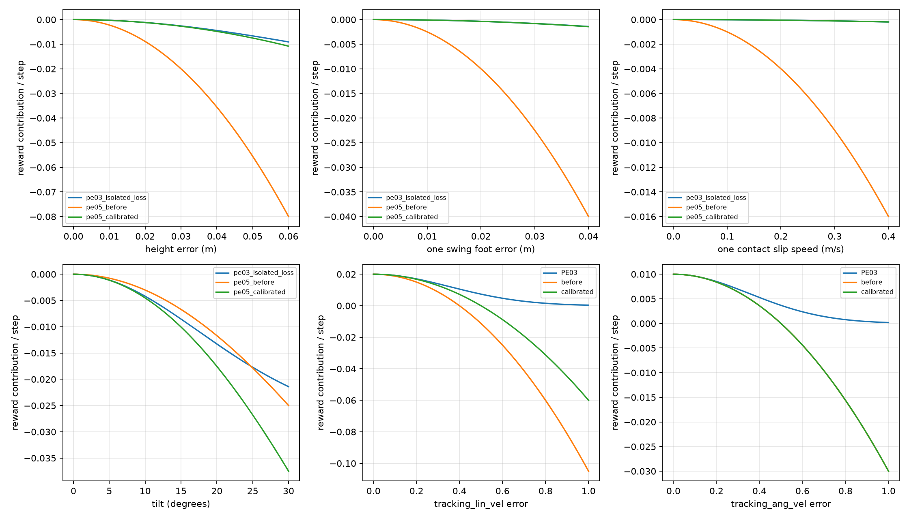
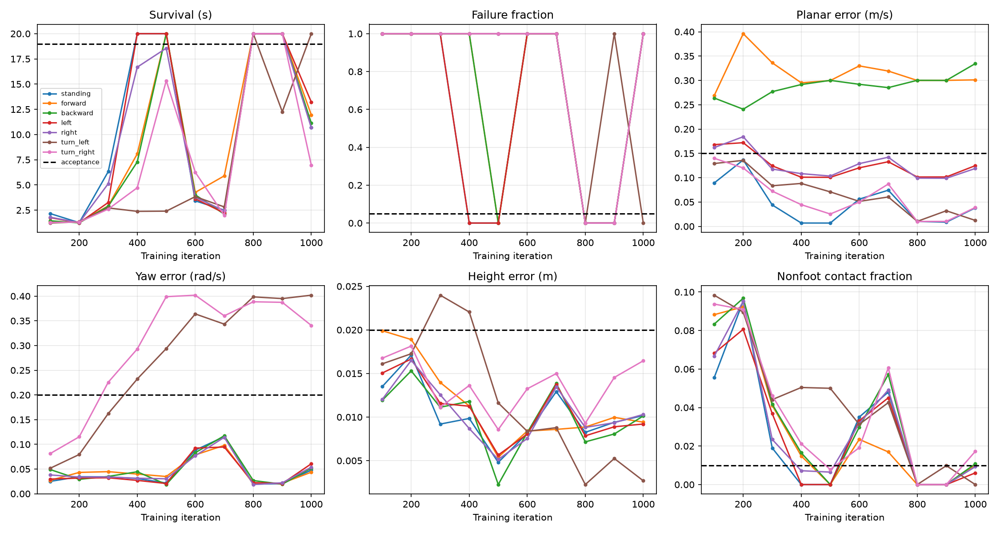

# PE05：参考 PE03 的奖励尺度校准

状态：2026-09-28，参数已落地，1000 轮训练和独立复评完成，**未通过基础行走验收**。保持 PE05 的 17 项
二次/线性误差奖励及有符号加权和，不引入 PE03 指数聚合、网络或观测。

## 来源与数理

标杆为 `logs/pe03_gait_fixed/2026-09-21_21-43-13_055597_mujoco/model_20000.pt`，
SHA256：`d8c3905a599195a43a62a6e4aa87abdaa941edb3adeff66d23dd2a0689cb57bc`。
当前 PE03 资产与 checkpoint 保存的资产指纹一致；校准工具遇到不一致会拒绝运行。
工具读取 checkpoint 内保存的配置，不依赖当前 PE03 YAML 替代历史配置。

PE03 的步长为 0.02 s，最大正奖励 P0=(1+0.5)×0.02=0.03，负奖励指数分母为
0.02。对于指数内代价 a·f(e)，孤立扣分为
`P0 × (exp(-dt·a·f(e)/0.02) - 1)`，在零误差附近等效于
`-dt × 1.5 × a × f(e)`。PE05 归一化平方项的权重因此为
`-1.5 × a × std²`；线性归一化项乘 `std`。

跟踪项单独匹配 `exp(-e²/0.25)` 的二阶展开 `1-e²/0.25`，所以线速度和角速度
误差尺度均为 0.5，保留 1.0/0.5 的正奖励权重。PE05 在大误差时仍可产生负奖励。

这仅是理想工作点的局部换算。其他误差存在时，PE03 的实际边际系数是
`positive_reward × attenuation / sigma_negative`；本次标杆轨迹的中位数为
1.053、P90 为 1.365。PE05 固定使用 1.5，不能声称在所有状态下与 PE03 等价。

## 参数

权重均在乘策略 dt 之前；带 std 的项还需除以 std²（软限位除以 std）。

| 项目 | 原权重 → 新权重 | 物理尺度 |
|---|---|---|
| tracking_lin_vel | 1 → 1 | std：0.4 → 0.5 m/s |
| tracking_ang_vel | 0.5 → 0.5 | std：0.5 rad/s |
| base_height | -1 → -0.135 | std：0.03 m；目标仍为 home |
| foot_clearance | -0.5 → -0.018 | std：0.02 m |
| contact_schedule | -0.5 → -0.5 | PE05 保留项，无精确对应公式 |
| collision | -3 → -5 | 阈值 1 N；所有部件倍率为 1，原小腿倍率为 2 |
| termination | -100 → -100 | PE05 保留项；仅真实失败一次扣 2 |
| feet_slip | -0.2 → -0.0024 | std：0.2 m/s |
| orientation | -0.2 → -0.3 | 重力投影 std：0.2 |
| lin_vel_z | -0.5 → -0.03 | m/s 的平方 |
| ang_vel_xy | -0.01 → -0.0015 | rad/s 的平方 |
| torques | -0.0002 → -0.00015 | N·m 的平方 |
| dof_acc | -2.5e-7 → -3.75e-7 | 策略步速度差分的平方 |
| action_rate | -0.01 → -0.024375 | 1.5×(0.01+0.1×0.25²) |
| action_smooth | -0.005 → -0.009375 | 1.5×0.1×0.25² |
| dof_pos_limits | -0.2 → -1.5 | std：0.1 rad；软范围 0.95 → 0.90 |
| feet_distance | -0.5 → -0.5 | PE05 保留项；下限 0.08 m，std 0.03 m |

高度误差 1/2/3 cm 的新每步贡献为 -0.0003/-0.0012/-0.0027。
单个摆动足净空误差 0.5/1/2 cm 对应 -0.0000225/-0.00009/-0.00036。
单个接触足滑速 0.05/0.1/0.2 m/s 对应 -0.000003/-0.000012/-0.000048。
碰撞逐部件独立累加，每个部件每策略步 -0.1，不设总碰撞零截断。

## 可复现审计

```bash
/ssd/conda/envs/aar_unilab/bin/python tools/calibrate_pe05_rewards.py \
  --old-task docs/assets/pe05_reward_calibration/before_task.yaml
```

修改前的配置已归档在 `docs/assets/pe05_reward_calibration/before_task.yaml`。
输出位于 `logs/reports/pe05_scale_calibration/`：

- `before_task.yaml`：本次修改前 PE05 完整任务配置。
- `calibration.json`：checkpoint 指纹、源/旧/新奖励配置、锚点贡献、误差分位数和分项统计。
- `reward_curves.png`：四组孤立惩罚损失及两组跟踪曲线。
- `source_trajectory.npz`：七组 20 秒标杆轨迹，包括位姿、速度、动作与八个物理子步的接触历史。

源策略只在 PE03 中运行。离线评估通过 PE05 的生产奖励函数计算两套 PE05 参数，
以 PE05 的 50% 支撑比和相位生成目标，不把 PE03 动作送给 PE05 网络。
为记录接触历史，把无外推力的八子步 PD 调用拆为八次单子步调用；其物理状态等价性
以 25 组随机动作另行校验，位姿、速度、关节速度和力矩最大差均为 0。只统计首次结束前样本，不把终止后的状态计入分位数。

标杆七组均存活 20 秒；高度误差 P50/P90/P95 为 5.74/15.47/21.06 mm，
倾角为 2.00/5.01/6.40 度。PE05 摆高目标下的摆动净空误差为 4.30/14.29/19.96 mm。
这些是 PE03 轨迹的离线重评分，不是 PE05 训练效果。

同一轨迹的 PE05 每步平均总奖励：旧参数 0.004964，新参数 0.011028。
孤立合成输入的每步总奖励：理想跟踪 0.030000、摆动足拖地 0.024142、
叠加非足端触地 -0.075858、再叠加真实失败 -2.075858。
这组输入只用于验证惩罚排序，不被当作物理可实现轨迹。



## 不能通过改权重消除的差异

- PE03 三角摆高/60% 支撑比，与 PE05 正弦平方摆高/50% 支撑比不同。
- PE03 滑移使用当前或前一步触地；PE05 只用当前触地。
- PE03 碰撞取当前传感器值；PE05 使用一个策略步内的历史任意接触。
- PE03 的目标平滑项屏蔽启动步；PE05 不屏蔽。合并一阶项的等效性限于启动之后。
- PE03 软限位还会限制 home 附近的边距；PE05 使用对称边距。本次两个 home 均合法。
- 接触时序、脚距和失败分是 PE05 保留的预算，不从不同物理量中强行换算。
- 离线重评分不计算 PE05 失败分：PE03 的终止事件不等于 PE05 的终止事件。

## 训练与验收协议

```bash
bash tools/train.sh pe05 +experiment=reward_calibration algo.max_iterations=1000
```

4096 环境、24 步 rollout、每 100 轮保存与评估，总上限 1000 轮。模型从头训练。
实验配置只覆盖运行预算、日志目录及基础验收设置，不改变训练命令课程。
旧 checkpoint 回放仍读其保存的奖励配置；奖励不同的严格 resume 被契约检查拒绝。

零指令、前后 ±0.3 m/s、横向 ±0.1 m/s、yaw ±0.4 rad/s，各运行 20 秒。

```bash
MUJOCO_GL=egl /ssd/conda/envs/aar_unilab/bin/python tools/evaluate_pe05_calibration.py \
  --checkpoint <run>/model_1000.pt --output <report>/final --render
/ssd/conda/envs/aar_unilab/bin/python tools/evaluate_pe05_calibration.py \
  --metrics <run>/metrics.jsonl --output <report>/progress
```

工具逐组判断验收，并生成评估历史曲线、回放视频和接触截图；同时记录实际平均速度，
避免把“小指令下静止也落在误差阈值内”误解为已经跟踪了该指令。
逐组存活率≥95%、平面误差≤0.15 m/s、yaw 误差≤0.2 rad/s、平均高度误差≤2 cm、
非足端接触比例≤1%。连续两次达标才进入最终回放检查。
当前无 reset 噪声，各组多个并行副本相同；该验收反映名义条件，不代表随机扰动鲁棒性。

## 验证与训练结果

- PE05 聚焦测试：77 项通过；本次新增/修改 Python 文件 Ruff 检查及格式检查通过。
- mypy：177 个源文件通过；WE11 flat/rough 各 2 个环境初始化并 step 5 次通过。
- 全量 `pytest -m "not slow"`：605 通过、2 xfailed、4 失败；其中 3 项为已有 PE03
  随机化课程的 max_level=0.7 与测试期望 1.0 不一致，另 1 项为只读 references 中已有
  嵌套 Git 元数据。全仓 Ruff 有 7 个既有问题，format 有 11 个既有文件不符合格式。
  详情保存在 `logs/reports/pe05_scale_calibration/validation.json` 及对应日志。
- 10 轮工程短训完成，7680 样本，checkpoint 与 ONNX release 导出成功；不作为行走验收。
- 正式 run：`logs/pe05_weighted/2026-09-28_15-27-23_266542_mujoco`。
  完成 1000 轮、98,304,000 样本，耗时约 33 分 15 秒；模型与 ONNX 工程导出完成。
  **最终模型未通过验收，不能将工程导出当作已验证可部署策略。**


### 最终独立复评

CPU 确定性推理，沿用配置的 8 个并行副本，每组上限 20 秒。七组中仅左移项落在数值阈值内，整体未通过；左移实际平均速度仍接近零，不能据此称为学会横移。
训练期间也没有出现连续两次全组通过。下表来自 `final/evaluation.json`，而非挑选最好轮次。

| 指令 | 持续时间 s | 失败率 | 平面误差 m/s | yaw 误差 rad/s | 高度误差 m | 非足端接触比例 |
|---|---:|---:|---:|---:|---:|---:|
| standing | 10.6200 | 1.0000 | 0.0399 | 0.0461 | 0.0103 | 0.0113 |
| forward | 11.5400 | 1.0000 | 0.3018 | 0.0489 | 0.0099 | 0.0104 |
| backward | 10.7600 | 1.0000 | 0.3323 | 0.0558 | 0.0105 | 0.0112 |
| left | 20.0000 | 0.0000 | 0.1023 | 0.0288 | 0.0068 | 0.0000 |
| right | 10.6800 | 1.0000 | 0.1192 | 0.0535 | 0.0104 | 0.0112 |
| turn_left | 20.0000 | 0.0000 | 0.0121 | 0.4019 | 0.0027 | 0.0000 |
| turn_right | 6.9800 | 1.0000 | 0.0393 | 0.3408 | 0.0165 | 0.0172 |

[逐组评估与完整指标](assets/pe05_reward_calibration/evaluation.json) ·
[每 100 轮验收历史](assets/pe05_reward_calibration/evaluation_history.json)



第 500 和 800 轮曾出现较好的静态支撑，但前后速度误差仍接近指令幅值 0.3 m/s，
转向误差接近 0.4 rad/s。第 500 轮名义 home 回放中，前进实际平均速度仅约
0.0006 m/s，不能把站满 20 秒称为完成 tracking。

最终回放肉眼检查：大部分时间双脚持续支撑，没有形成交替迈步；失衡后身体触地，
右转场景还出现大腿触地。回放诊断也显示摆动中段的近地比例接近 1。
最后一轮课程接触力得分约 0.50，低于 0.90 阈值，课程成功窗口为 0，仍停在初始命令范围。

视频使用同样的零噪声/1 mm 净空重置协议，但为单环境可视化模型；CPU 复评、训练时
GPU 评估与单环境可视化的倒地时间存在差异。例如最终左移视频可以站满 20 秒，
训练时的 GPU 批量评估则提前倒地。这进一步说明稳定性不足；视频不是替代批量验收的通过证据。

### 诊断与边界

高度、滑移、平滑等连续项的局部曲率校准通过了公式和生产函数测试，但这不保证 PPO
会学到步态。特别是接触时序项在 V1 中按计划保留了 -0.5，未进行精确迁移。
一个明确的预算差异是：在摆动足仍承受半个体重、期望一支撑一摆动的孤立场景，
PE03 接触力项导致的正奖励损失约 0.02594/步，PE05 时序错一脚仅扣 0.005/步，
相差约 5.19 倍。两项的物理量不同，这个锚点不能当作全局等价换算，也不是因果消融证明，
但它与双脚持续支撑的实际表现一致，说明后续应优先重新校准步态接触预算。

本轮保持约定的参数，没有中途增加该权重、修改网络/课程/终止条件或延长训练。
下一轮不能直接以“继续训练即可”作为结论，需要针对静态支撑与迈步的收益差做验证。

### 交付文件

- [最终 checkpoint](../logs/pe05_weighted/2026-09-28_15-27-23_266542_mujoco/model_1000.pt)
- [训练配置](../logs/pe05_weighted/2026-09-28_15-27-23_266542_mujoco/training_config.yaml)
- [明确的未通过标记](../logs/pe05_weighted/2026-09-28_15-27-23_266542_mujoco/acceptance.json)
- [最终回放目录](../logs/reports/pe05_scale_calibration/final/replays/)，含七个 MP4、截图和接触诊断。
- [数理校准报告](assets/pe05_reward_calibration/calibration.json)、[验证记录](assets/pe05_reward_calibration/validation.json)。
