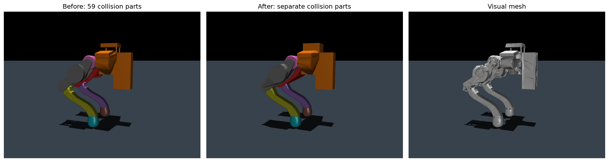

# PE02 专用碰撞体

当前版本：`dianzu23-collision-v2-20260916`。URDF 与 MJCF 使用同一套训练碰撞体。
碰撞 v2 改造保留源 CAD、视觉网格、各连杆质量/惯量、关节和 home。
此后视觉网格已单独恢复为无减面的原始几何 OBJ，碰撞体仍采用本页的 v2 方案。

## 几何构建

| 部位 | 数量 | 方法 |
| --- | ---: | --- |
| 机身 | 8 | 3 个盒体、2 个电机圆柱、3 个支架凸包；保留侧支架之间的间隙 |
| 每侧髋部 | 2 | 电机圆柱和支架凸包 |
| 每侧大腿 | 3 | 内外侧板分别取凸包，内部电机、轴承及横杆合为一个凸包 |
| 每侧小腿 | 3 | 沿膝轴至足端方向切为三段，再分别取凸包 |
| 每侧足端 | 1 | 减面的曲面凸包，保留默认接触面附近的原始 CAD 顶点 |

合计 **26 个碰撞体**：3 个盒体、4 个圆柱体、19 个凸包网格。
上一版为 59 个碰撞体（35 个网格）。全部碰撞网格共 1260 个顶点、2444 个三角面，
上一版分别为 7430 和 14720。正式训练模型 buffer 从 3805908 降至 666388 字节，
减少约 82.5%；原始视觉网格不进入训练模型。

`../collision_recipe.json` 保存 CAD 连通部件选择、分段位置、误差和保护范围。
部件按表面积排序。左右腿先拟合左侧，再在各连杆局部 y 方向镜像生成右侧。
原 v1 配方保存在 `collision_recipe_v1.json`，可结合未修改的源 CAD 离线重建。

## 减面误差与足端保护

凸包采用内接近似：从原始凸包选取顶点，逐步加入最偏离当前近似的顶点。
完成前对所有原始凸包顶点计算真实点到表面的欧氏距离，要求不超过 **0.5 mm**。
因为到凸集的距离是凸函数，该检查为整个原始凸包提供距离上界；新凸包也不会
外扩到原凸包之外。这个界针对每个选定部件组，不代表合并零件后填充空隙的误差。
STL 使用 float32 存储，另有微小的浮点舍入。

足端保留距默认支撑平面 1 mm 内的 106 个原始顶点，包括原接触三角形。
每只足端从 2351 顶点 / 4698 面降到 230 顶点 / 456 面，最大几何误差约 0.498 mm。
默认姿态下，支撑平面上方 0.1、0.25、0.5 mm 截面积分别保持
29.0286、66.8436、130.9947 mm²。1 mm 处约为 239.69 mm²，原为 253.31 mm²。
这些截面积是曲面几何指标，不是弹性脚垫的实际接触面积。

## 物理数据与几何检查

- 总质量 **3.22689 kg**；各连杆质量、质心和完整惯量均来自原 URDF。
- MJCF `inertiafromgeom="false"`，连杆显式 `<inertial>`，碰撞几何密度为 0。
- 保留关节轴、机械零位、限位、阻尼、armature、执行器和 home。
- 默认姿态两足贴地，其余部件离地，无自碰撞；左右碰撞体支撑投影在浮点精度内镜像。
- home 附近 ±5°、裁剪到合法限位的 500 组姿态检查无自碰撞；检查时抬高根部以排除地面。
- 三段小腿凸包体积比整段凸包减少约 **23.88%**，仍保留原整段凸包填平的弯曲空隙。
  原五段版本减少约 26.05%，三段版本对该空隙的近似更粗。
- 每连杆 5000 个 CAD 表面面积加权样本，最大外露距离均小于 0.5 mm。
  这不能作为代理体外包/填充空隙误差的上界。
- 1000 组全限位姿态中，本版 329 组存在自碰撞；上一版 59 个碰撞体为 283 组。
  分组凸包会填充部分零件间隙，完整限位范围也不等于无碰撞运动空间。
  本次没有关闭自碰撞、删除检测对或扩大关节限位来提高吞吐。

详细数据见 `collision_audit.json`、`collision_optimization.json` 和
[训练性能报告](../../../../../../docs/PE02_COLLISION_OPTIMIZATION.md)。

## 重建

离线依赖：`trimesh==5.1.0`、`fast-simplification==0.2.0`（仅视觉转换使用）。
正常训练不依赖这些离线工具。仓库根目录执行：

```bash
OPENBLAS_NUM_THREADS=1 /ssd/conda/envs/aar_unilab/bin/python tools/build_pe02_collisions.py
OPENBLAS_NUM_THREADS=1 MUJOCO_GL=egl /ssd/conda/envs/aar_unilab/bin/python tools/audit_pe02_collisions.py --render
```

构建器检查源 STL 校验值，更新碰撞网格、URDF、MJCF 和 manifest，并清理过期的
生成网格。再次运行 URDF 导入器也会保留这些碰撞网格。已有 release 使用其冻结
资产；新训练会使用 v2，旧模型 checkpoint 因资产指纹不同不能直接续训。


