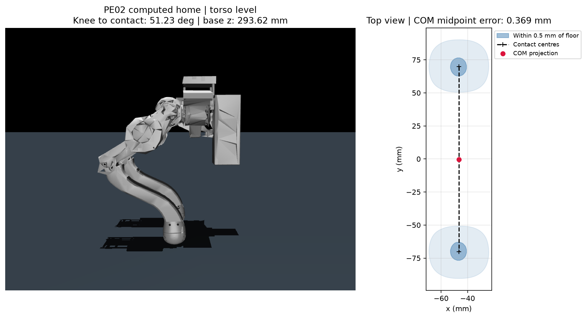

# PE02 默认站姿

根据当前 URDF 的 3.22689 kg 全机质量、各连杆重心和原始足端 STL 计算。
机身保持水平，左右关节采用镜像角度，机械限位标定零位保持不变。
计算结果已写入 `scene.xml` 的 `home` 关键帧。

| 关节 | 相对机械零位 / ° | 相对机械零位 / rad |
| --- | ---: | ---: |
| L_hip_ | 1.326962 | 0.023159860 |
| L_thigh_ | -18.989675 | -0.331432355 |
| L_calf_ | -70.765210 | -1.235085919 |
| R_hip_ | -1.326962 | -0.023159860 |
| R_thigh_ | 18.989675 | 0.331432355 |
| R_calf_ | 70.765210 | 1.235085919 |

- 根节点位置：`[0, 0, 0.2936162713]` m；四元数 wxyz：`[1, 0, 0, 0]`。
- 全机重心：`[-0.046558584, -0.000489060, 0.218294884]` m。
- 左支撑中心：`[-0.046558584, 0.069935712, 0]` m。
- 右支撑中心：`[-0.046558584, -0.070175712, 0]` m。
- 两足支撑中心间距：140.111 mm。重心前后误差小于 0.001 mm，
  左右偏右 0.369 mm；这里按模型 +y 为左侧。此残差来自质量分布不完全对称，
  为保留机身水平和左右对称姿态而保留，满足本次采用的 0.5 mm 居中容差。
- 小腿转轴中心到足底支撑中心的连线与地面夹角：两侧均为 **51.2337°**。
  这是几何连线角度，不能直接作为小腿电机的关节角度。

## 足底几何与求解方法

足底朝外的一端是圆弧面，没有可以整体铺平的大平面。
STL 内部较大的平面是装配/分割面，不能当作足底。
因此本次用网格外凸包的支撑平面识别可贴地朝向；使用未简化的原始足端 STL，
两只脚的视觉网格未减面。专用碰撞体使用原始左足凸包和其右侧镜像，
所选支撑三角面、支撑高度与默认站姿保持一致。

在足底帽形区域的凸包三角面法向中搜索，限定向两侧张开不超过 10°，
并要求“小腿转轴到支撑中心”与地面的夹角处于用户给出的 45–56°。
按距离支撑平面 0.5 mm 处的凸包截面积排序，选择最大的候选朝向。
随后用 MuJoCo 正运动学和全机质量分布解出关节角与根节点高度，满足：
左右镜像、机身水平、两脚同时贴地、前后重心居中、所有关节在机械限位内。
这是一组带明确对称性约束的默认解，不是所有可能站姿的全局最优证明。

选中支撑面的局部法向：

```text
左脚 [-0.999722690, -0.023157789, -0.004273221]
右脚 [-0.999722690,  0.023157789, -0.004273221]
```

站姿下两者都变为世界坐标 `[0, 0, -1]`。
每脚选中的刚性 STL 支撑三角面面积为 **2.1746 mm²**。
足底曲面贴近地面的投影区域随允许的高度差变化：

| 距支撑平面的高度差 / mm | 单脚截面积 / mm² |
| ---: | ---: |
| 0.10 | 29.029 |
| 0.25 | 66.844 |
| 0.50 | 130.995 |
| 1.00 | 253.307 |
| 2.00 | 473.454 |

这些截面积是选择朝向的几何指标，不是受力后的真实接触面积。
如果实物脚垫具有柔性，需要材料和受力数据才能计算形变后的面积；
如果设计要求大块平面接触，则需另外核对 CAD 足底形状并更新碰撞几何。
仅调整关节角无法把当前圆弧面变成平面。



## 初始化与回放

`conf/pe02/task/pe02_flat.yaml` 默认使用 `env.reset_keyframe=home` 和
`env.initial_height=null`。`null` 表示直接采用关键帧的贴地高度。
显式设置 `env.initial_height=0.41` 只覆盖根节点 z，关节仍使用所选关键帧；
抬高后的姿态自然不再贴地。

Python 在后端构造阶段解析关键帧 ID；reset 仅恢复状态，不重新读 XML/STL。
第一次观测只有历史末帧包含站姿关节角，其余历史帧置零。
完整配置随 checkpoint 保存；导出把关键帧选择写入
`deployment_manifest.json` 的可选 `task.reset_keyframe`，并将高度覆盖写入
发布包的任务场景，使 C++ 和 Python 从同一姿态开始。

旧配置没有 `reset_keyframe` 时继续使用机械零位和原来的高度；
更早的无配置 PE02 checkpoint 使用机械零位及 0.38 m 初始高度。
PE02 没有导入或继承 PE01 的环境、网络或训练代码。

## 校核范围与复现

URDF 独立正运动学与 MuJoCo 在该站姿一致；两脚离地误差小于 0.000001 mm。
当前碰撞模型未检测到自碰撞；除脚以外最低部件为小腿，距地约 34.86 mm。
碰撞体已按部件重建，小腿分为五段凸包；见 [碰撞体说明](COLLISION_GEOMETRY.md)。
活动范围随机抽样仍可检测到大幅折叠时的干涉，不能认为任意限位内组合都可行。

该姿态是训练/控制初始化参考，不保证零力矩下自行站稳。
按两足竖直支撑力估算的静态关节力矩约为
`[-0.0256, 0.4907, 1.8617, 0.0264, -0.4925, -1.8828]` N·m；
此估计未作为前馈接入控制器，不能替代平衡反馈或实机标定。
求解时的 v1 适配器使用归一化力矩；现有正式 v2 训练使用相对 home 的角度偏移
和位置 PD，详见[迁移说明](../../../../../../docs/PE02_TRAINING_MIGRATION.md)。

在仓库根目录执行，可重新计算并更新关键帧、数据与图片：

```bash
env -u PYTHONPATH MUJOCO_GL=egl \
  /ssd/conda/envs/aar_unilab/bin/python tools/solve_pe02_standing_pose.py --write --render
```

去掉 `--write --render` 只计算并打印报告。
原始 URDF 和 STL、MuJoCo 机器人文件的校验值见 `standing_pose.json`。
任务站姿留在场景 XML 中，重新从 URDF 生成机器人时沿用此场景模板。

## 本次验证（2026-09-16）

下列为站姿接入阶段的记录；碰撞体改造后的最新验证见 [碰撞体说明](COLLISION_GEOMETRY.md)。

- PE02 专项：16 项通过，覆盖源 URDF 正运动学、重心/接地、重复 reset、
  首帧历史、缺失关键帧报错、旧 checkpoint、默认高度和显式高度覆盖的发布包。
- 全仓库非 slow 测试：214 passed，2 xfailed。
- C++ 构建及现有 6 项 CTest 通过。
- 默认站姿完成最小训练、ONNX 导出和无界面 Python 回放；
  Python/C++ 在 1、10、100 步的动作、控制量和根节点高度上最大误差为 0。
- WE11 平地及粗糙地形任务完成 Hydra 配置组合、初始化和步进，观测仍为
  dictionary，数值有限。
- 本次修改的 Python 文件通过 Ruff format/check；`git diff --check` 通过。
  全仓库原有 13 个文件格式问题、7 个 Ruff 问题及
  `src/unilab/base/backend/mujoco/playback.py:35` 的 mypy 问题仍存在，未扩大修改范围。

上述检查验证几何和软件合同，没有进行实机站立验证或完整步态训练。
